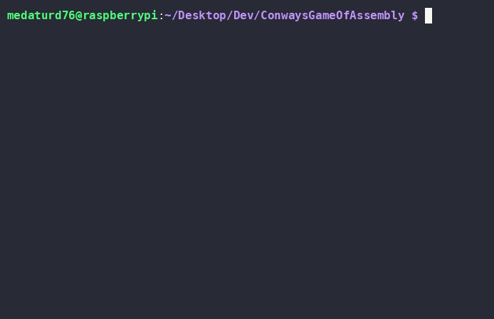

# Medatur76's Game Of Assembly

I was pretty bored during school last week and decided to dedicate the 8hrs I try not falling asleep to actually learning a bit more about coding.    
This is the product of those 10 days of work.   
683 lines of arm64 assembly to make a scaleable, editable grid that display Conways Game Of Life:

There is also a version in C that is 100x more readable to understand the logic behind the two big features tactics I employed for fun:

* Using half and full box characters to display two cells in one character space on the console
* Storing each cell as one byte in a massive array rather than storing each as a char, making it 8x more efficient

Additionally, the game features:

* Command-line params to control width and height. You can pass one arg to set both with and height: ``./run.sh <length>`` or two to control them independently: ``./run.sh <height> <width>``
* Instructions under the box to inform on keybinds and current game state
* A cursor to edit the game during the paused state, controlled by arrow keys

Just as an FYI if you get a segfault, I do recommend exiting the terminal as the default terminal state will pretty much be gone. Error checking is hard in assembly sorry